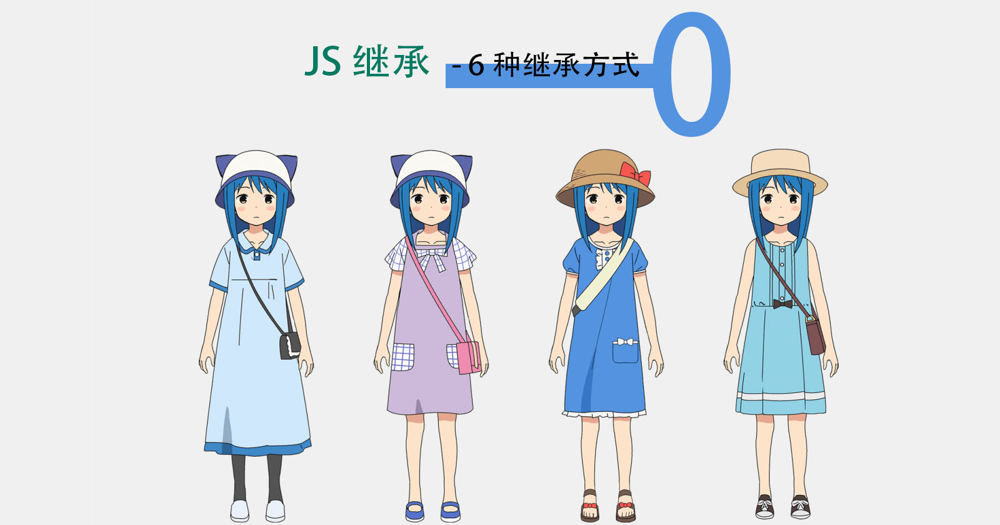


[530986963, 531040878]


### 前言

在开发大型项目的时候，我们经常需要用到对象，不论是使用内置对象、扩展对象或者自定义对象等，都是为了很好的把属性和方法封装在一起。所以本次我将 js 原型链以及继承自我总结一下，加强理解。

一张图补一下 `原型链` 的知识, 图片来自掘金作者[一灯](https://juejin.im/post/6844903826143592461)


关于 JS 继承分为 6 种

- 原型链继承
- 借用构造函数继承
- 组合继承（组合原型链继承和借用构造函数继承）（常用）
- 原型式继承
- 寄生式继承
- 寄生组合式继承（常用）

#### 原型链继承

```js
// 首先定义了两个类型 Person 和 Teacher。
// 父类
function Person(name) {
  this.name = name
  this.todo = function (sth) {
    console.log(sth)
  }
}

// 老师
function Teacher() {
  this.name = '张三'
}

// Person 原型 age 属性赋值
Person.prototype.age = 23

// 通过创建 Person 的实例（new Person()），并将该实例赋给 Teacher 的原型 （Teacher.prototype） 的方式继承了 Person。
// 即：Teacher 的原型 （Teacher.prototype） = Person 的实例（new Person()），实现继承
Teacher.prototype = new Person()

// new 一个数学老师出来
const MathTeacher = new Teacher()

// 此时存在于 Person 中实例中的所有属性和方法，也存在于 Teacher.prototype 中。
// Teacher的实例 MathTeacher 指向 Teacher 的原型 Teacher.prototype，Teacher.prototype 又指向 Person 的原型。

// MathTeacher 本身没有 todo(),todo 来自 Teacher.prototype
MathTeacher.todo('教数学') // 教数学

// MathTeacher 自己有 name， 所以输出的是自己的 name
console.log(MathTeacher.name) // 张三

// MathTeacher、Teacher.prototype（等同Person 的实例）都没有 age 属性， 这里的 age 属性来自 Person.prototype
console.log(MathTeacher.age) // 23
```
