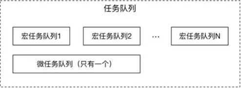

### 前言

> 在项目中经常接触`异步任务`, 要是相互独立还好，要是它们相互依赖，那就麻烦咯，所以我们需要掌握一些控制它们的方法（毕竟自己的代码还是应该在自己掌控之下，代码可信），控制它们加载的时机

---

### 准备

我们都知道 JavaScript 是单线程，单线程就意味着，任务要一件件来办，JavaScript 引擎执行异步代码而不用等待，是因为有`消息队列`和`事件循环 (Event Loop)`

**消息队列**
消息队列是一个先进先出的队列，它里面存放着任务。
而消息队列中的每个任务都称之为宏任务，每个宏任务中都存放着一个微任务队列。
当宏任务结束前，会执行微任务列表中的任务，完成之后才会执行下一个宏任务。
微任务主要用来解决任务优先级的问题和单个任务执行时间过长的问题。

**微任务包括**：`MutationObserver`、`Promise.then()`或 `catch()`、`Promise 为基础开发的其它技术`，比如 `fetch API、V8` 的垃圾回收过程、Node 独有的 `process.nextTick`

**宏任务包括**：`script` 、`setTimeout`、`setInterval` 、`setImmediate` 、`I/O` 、`UI rendering`

**Event Loop**
主线程的读取过程基本上是自动的，只要执行栈一清空，"消息队列"上第一位的事件就自动进入主线程。
这个过程是循环不断的，所以整个的这种运行机制又称为 `Event Loop（事件循环）`。

event loop 的执行顺序：

- 一开始整个脚本作为一个宏任务执行
- 执行过程中同步代码直接执行，宏任务进入宏任务队列，微任务进入微任务队列
- 当前宏任务执行完出队，检查微任务列表，有则依次执行，直到全部执行完
- 执行浏览器 UI 线程的渲染工作
- 检查是否有 Web Worker 任务，有则执行
- 执行完本轮的宏任务，回到 2，依此循环，直到宏任务和微任务队列都为空

---

### Promise 题目

- 遇到声明变量右边是普通同步代码也会执行(代码包裹在函数体内 则在调用处执行)
- `new Promise()` 中没有 `resolve()` 或者 `reject()` 不会执行它的 `then()`
- `promise.then()` 支持链式写法，可得知它返回的是一个新的 `promise`
- `定时器` 功能，主线程首先要检查一下执行时间，某些事件只有到了规定的时间，才能返回主线程
- 如果在执行 `微任务` 的过程中，又产生了 `微任务`，那么会加入到队列的末尾，也会在这个周期被调用执行；



#### 基础 Promise

#### 1.1

```js
const promise1 = new Promise((resolve, reject) => {
  console.log('promise1')
})
console.log('1', promise1)
```

过程分析：

- 从上至下，先遇到 `new Promise`，执行该构造函数中的代码 `promise1`
- 然后执行同步代码 `1`，此时 `promise1` 没有被 `resolve` 或者 `reject`，因此状态还是 `pending`

总结：

1. 遇到声明变量右边是普通同步代码也会执行(代码包裹在函数体内 则在调用处执行)

输出:

```js
'promise1'
'1' Promise{<pending>}
```

#### 1.2

```js
const promise = new Promise((resolve, reject) => {
  console.log(1)
  resolve('success')
  console.log(2)
})
promise.then(() => {
  console.log(3)
})
console.log(4)
```

过程分析：

- 从上至下，先遇到 `new Promise`，执行该构造函数中的代码
- 遇到 `console.log(1)`，输出 `1`
- 遇到 `resolve("success");` 将 promise 状态改为 resolve ，并将值保存下来
- 遇到 `console.log(2)`，输出 `2`
- `new Promise` 内部代码执行完毕，跳出来遇到 `promise.then`，将其加入微任务队列
- 遇到 `console.log(4)`，输出 `4`
- 本轮宏任务全部执行完毕，检查微任务队列，发现 `promise.then` 这个微任务且状态为 `resolved`，执行它,输出 `3`。

输出:

```js
1 2 4 3
```

#### 1.3

```js
const promise = new Promise((resolve, reject) => {
  console.log(1)
  console.log(2)
})
promise.then(() => {
  console.log(3)
})
console.log(4)
```

过程分析：

因为`new Promise()` 中没有 `resolve()` 或者 `reject()` 不会执行它的 `then()`

输出:

```js
1 2 4
```

#### 1.4

```js
const promise1 = new Promise((resolve, reject) => {
  console.log('promise1')
  resolve('resolve1')
})
const promise2 = promise1.then((res) => {
  console.log(res)
})
console.log('1', promise1)
console.log('2', promise2)
```

过程分析：

- 从上至下，先遇到 `new Promise`，执行该构造函数中的代码
- 从上至下，先遇到 `new Promise`，执行该构造函数中的代码
- 遇到 `console.log("promise1");`，输出 `promise1`
- 遇到 `resolve("resolve1");` 将 promise 状态改为 `resolve` ，并将值保存下来
- `new Promise` 内部代码执行完毕，跳出来遇到 `promise.then`，将其加入微任务队列
- 遇到 `console.log("1", promise1);`，且 `promise1` 的状态已经被改变为 `resolve`， 输出 `1 Promise{<resolved>: 'resolve1'}`,
- 遇到 `console.log("2", promise2);`，且 `promise2` 是新的 状态为 pendding 的 promise， 输出 `2 Promise{<pendding>}`,
- 宏任务执行完毕，查找微任务队列，发现 `promise1.then` 这个微任务且状态为 `resolved`，执行它，输出 `resolve1`

总结：

1. `promise.then()` 支持链式写法，可得知它返回的是一个新的 `promise`

输出:

```js
'promise1'
'1' Promise{<resolved>: 'resolve1'}
'2' Promise{<pendding>}
'resolve1'
```

#### 1.5

```js
const fn = () =>
  new Promise((resolve, reject) => {
    console.log(1)
    resolve('success')
  })
fn().then((res) => {
  console.log(res)
})
console.log('start')
```

要点：`函数调用时才执行内部逻辑`

过程分析：

- 从上至下，先遇到声明 `fn ()`，函数内部代码在函数调用处执行
- 遇到调用 `fn()`，执行内部代码，输出 `1`
- 遇到 `resolve("success");` 将 promise 状态改为 `resolve` ，并将值保存下来
- 完成函数内部调用，跳出函数内部， 遇到 `promise.then`，将其加入微任务队列
- 遇到 `console.log(start);`，输出 `start`
- 宏任务执行完毕，查找微任务队列，发现 fn 函数的 `then` 这个微任务且状态为 `resolved`，执行它，输出 `success`

输出:

```cmd
1
'start'
'success'
```

#### 1.6

```js
const fn = () =>
  new Promise((resolve, reject) => {
    console.log(1)
    resolve('success')
  })
console.log('start')
fn().then((res) => {
  console.log(res)
})
```

若是 fn 在最后调用，结果也很明显了

输出:

```cmd
'start'
1
'success'
```

#### Promise 与 setTimeout

#### 2.1

```js
console.log('start')
setTimeout(() => {
  console.log('time')
})
Promise.resolve().then(() => {
  console.log('resolve')
})
console.log('end')
```

要点：`setTimeout`为延迟任务，添加到下一轮宏任务，并且到时间才会被入栈

过程分析：

- 从上至下，遇到 `console.log(start);`，输出 `start`
- 遇到 `setTimeout()`是个宏任务，进入下一轮的宏任务队列（🚦 注意：是下一轮），即`宏 2`（第二轮宏任务）
- 遇到 `Promise.resolve()` 直接执行，将 promise 状态改为 `resolve`， 将 `then()` 放入本轮微任务
- 从上至下，遇到 `console.log(end);`，输出 `end`
- 本轮宏任务执行完毕，查找微任务队列，发现 `then` 这个微任务且状态为 `resolved`，执行它，输出 `resolve`
- 下一轮宏任务（宏 2）开始，执行 `setTimeout`，输出 `time`

输出:

```js
'start'
'end'
'reslove'
'time'
```

#### 2.2

```js
const promise = new Promise((resolve, reject) => {
  console.log(1)
  setTimeout(() => {
    console.log('timerStart')
    resolve('success')
    console.log('timerEnd')
  }, 0)
  console.log(2)
})
promise.then((res) => {
  console.log(res)
})
console.log(4)
```

要点：`setTimeout` 为宏任务, `promise.then` 状态为 `padding` 不执行

过程分析：

- 从上至下，遇到 `console.log(1);`，输出 `1`
- 遇到 `setTimeout()`是个宏任务，进入下一轮的宏任务队列（🚦 注意：是下一轮），即`宏 2`（第二轮宏任务）
- 遇到 `console.log(2);`，输出 `2`
- 遇到 `promise.then()` 这个微任务且状态为 `padding`，不执行
- 遇到 `console.log(4);`，输出 `4`
- 本轮宏任务执行完毕，查找微任务队列，无微任务，开始下一轮宏任务（这种循环机制便是 `Event Loop`）

  **------------下一轮------------**

- 下一轮宏任务（宏 2）开始，执行 `setTimeout`
- 在宏 2 遇到 `console.log(timerStart)`，输出 `timerStart`
- 在宏 2 遇到 `resolve('success')`，将 promise 的状态改为 `resolved` 且保存结果并将之前的 `promise.then` 推入微任务队列(待验证)
- 在宏 2 遇到 `console.log(timerEnd)`，输出 `timerEnd`
- 在宏 2 也全部执行完毕，查找微任务队列，发现 `promise.then` 这个微任务，执行它，输出 `success`
  输出:

```cmd
1
2
4
'timerStart'
'timerEnd'
'success'
```

#### 2.3

```js
Promise.resolve().then(() => {
  console.log('promise1')
  const timer2 = setTimeout(() => {
    console.log('timer2')
  }, 0)
})
const timer1 = setTimeout(() => {
  console.log('timer1')
  Promise.resolve().then(() => {
    console.log('promise2')
  })
}, 0)
console.log('start')
```

要点：

- 1.微任务队列上创建的宏任务会被后添加到当前宏任务队列的尾端，微任务队列中创建的微任务会被添加到微任务队列的尾端。
- 2.只要微任务队列中还有任务，宏任务队列就只会等待微任务队列执行完毕后再执行。

过程分析：

- 从上至下，遇到 `Promise.resolve()`，promise 状态改为 `resolve`, 将 `then()`加入`微 1`(本轮微任务)
- 遇到 timer1 的`setTimeout()`是个宏任务，加入下一轮的宏任务队列（🚦 注意：是下一轮），即`宏 2`（第二轮宏任务）
- 遇到 `console.log(start);`，输出 `start`
- 本轮宏任务执行完毕，查找微任务队列，执行`微 1` 的 `then()`
- 微 1 遇到 `console.log('promise1')`，输出 `promise1`
- 遇到 timer2 的 `setTimeout()`是个宏任务，加入宏任务队列末尾，即`宏 3`（第三轮宏任务）
  **------------下一轮------------**

- 在宏 2 timer1 的 `setTimeout` 最先加入第二轮宏任务，所以先执行其内部代码
- 在宏 2 遇到 console.log('timer1')， 输出 `timer1`
- 在宏 2 遇到 `Promise.resolve().then(()`，一气呵成，改变 promise 状态为 `resolve`，并且将 `then()` 加入`微任务`
- timer1 的`宏2` 执行完毕，接着开始去执行所有`微任务`，执行 `then()`，输出 `promise2`

  **------------下一轮------------**

- 在宏 3 剩下 timer2 的 `setTimeout` ，输出 `timer2`

总结：

1. 如果在执行 `宏任务（宏2）` 的过程中，又产生了 `宏任务（宏3）`，那么会加入到队列的末尾，会在执行完`宏2`到`微任务` 再到 `（宏3）`
2. 如果在执行 `微任务` 的过程中，又产生了 `微任务`，那么会加入到队列的末尾，也会在这个周期被调用执行；

```cmd
'start'
'promise1'
'timer1'
'promise2'
'timer2'
```

#### 2.4

```js
const promise1 = new Promise((resolve, reject) => {
  setTimeout(() => {
    resolve('success')
  }, 1000)
})
const promise2 = promise1.then(() => {
  throw new Error('error!!!')
})
console.log('promise1', promise1)
console.log('promise2', promise2)
setTimeout(() => {
  console.log('promise1', promise1)
  console.log('promise2', promise2)
}, 2000)
```

总结：

1. `Promise.then()`抛出了一个错误，且将 promise2 的状态设置为了 `rejected`
   如果是 `return` 则状态为 `resolve`

```js
'promise1' Promise{<pending>}
'promise2' Promise{<pending>}
test5.html:102 Uncaught (in promise) Error: error!!! at test.html:102
'promise1' Promise{<resolved>: "success"}
'promise2' Promise{<rejected>: Error: error!!!}
```

#### 2.5

```js
const promise1 = new Promise((resolve, reject) => {
  setTimeout(() => {
    resolve('success')
    console.log('timer1')
  }, 1000)
  console.log('promise1里的内容')
})
const promise2 = promise1.then(() => {
  throw new Error('error!!!')
})
console.log('promise1', promise1)
console.log('promise2', promise2)
setTimeout(() => {
  console.log('timer2')
  console.log('promise1', promise1)
  console.log('promise2', promise2)
}, 2000)
```

过程分析：

- 遇见 `promise1`， 将 `setTimeout` 加入 `宏1`
- 遇见 `console.log('promise1里的内容')` 输出 `promise1里的内容`
- 遇见 `promise2`， 不执行
- 由于 promise1、promise1 都未改变状态，所以输出
  `'promise1' Promise{<pending>} 和 'promise2' Promise{<pending>}`
- 遇见 `setTimeout` 加入 `宏2`

**------------下一轮------------**

- 执行 `宏1`， `promise1` 状态改为 `resolve`, 输出 `timer1`
- `宏1` 执行完，检查 `微任务` 发现 `promise2` 可以执行, 抛出一个错误
- 然后执行到 `宏2`，输出 `timer2`
- `promise1` 已经 `resolve` ，`promise2`，由于抛出错误，所以 `rejected`

```js
'promise1里的内容'
'promise1' Promise{<pending>}
'promise2' Promise{<pending>}
'timer1'
test5.html:102 Uncaught (in promise) Error: error!!! at test.html:102
'timer2'
'promise1' Promise{<resolved>: "success"}
'promise2' Promise{<rejected>: Error: error!!!}
```

### Promise 中的 then、catch、finally

#### 3.1

```js
const promise = new Promise((resolve, reject) => {
  resolve('success1')
  reject('error')
  resolve('success2')
})
promise
  .then((res) => {
    console.log('then: ', res)
  })
  .catch((err) => {
    console.log('catch: ', err)
  })
```

结果:

```js
'then: success1'
```

Promise 的状态一经改变就不能再改变

#### 3.2

```js
Promise.reject(1)
  .then((res) => {
    console.log(res)
    return 2
  })
  .catch((err) => {
    console.log(err)
    return 3
  })
  .then((res) => {
    console.log(res)
    return new Error('error!!!')
  })
  .then((res) => {
    console.log(res)
  })
```

- catch 不管被连接到哪里，都能捕获上层未捕捉过的错误
- return 3 会被包装成 `resolve(3)`
- return new Error('error!!!') 会被包装成 `resolve(new Error('error!!!'))`

结果

```bash
1
3
'Error: error!!!'
```

如果不希望继续向下，可以

```
return Promise.reject(new Error('error!!!'));
// or
throw new Error('error!!!')
```

#### 3.3

```js
const promise = Promise.resolve().then(() => {
  return promise
})
promise.catch(console.err)
```

`.then` 或 `.catch` 不能返回 promise 本身，不然会造成死循环。

结果：

```js
Promise {<rejected>: TypeError: Chaining cycle detected for promise #<Promise>}
```

#### 3.4

```js
Promise.resolve(1).then(2).then(Promise.resolve(3)).then(console.log)
```

中间的两个 `then` 不是一个函数，则 `1` 会往下走

结果：

```js
1
```

#### 3.5

```js
Promise.reject('err!!!')
  .then(
    (res) => {
      console.log('success', res)
    },
    (err) => {
      console.log('error', err)
    }
  )
  .catch((err) => {
    console.log('catch', err)
  })
```

结果：

```js
'error' 'error!!!'
```

如果 `then` 无第二个参数，那么错误将进入 `catch`
如果错误由 `then`内部产生，那么错误将向下走进入 `catch`

#### 3.6

```js
function promise1() {
  let p = new Promise((resolve) => {
    console.log('promise1')
    resolve('1')
  })
  return p
}
function promise2() {
  return new Promise((resolve, reject) => {
    reject('error')
  })
}
promise1()
  .then((res) => {
    console.log(res)
    return 'finally 会传下去'
  })
  .catch((err) => console.log(err))
  .finally(() => console.log('finally1'))
  .then((res) => console.log(res))

promise2()
  .then((res) => console.log(res))
  .catch((err) => console.log(err))
  .finally(() => console.log('finally2'))
```

- 链式调用都需要等上一个完成才可以执行，所以 `promise1` 的 `then` 不会马上到 `finally`
- `finally` 会返回上一个 Promise 对象值
- `finally` 回调函数不接受任何的参数
- 别忘记了 `then、catch 和 finally` 是微任务

结果：

```bash
promise1
1
error
finally1
finally2
'finally 会传下去'
```

### Promise 中的 all 和 race

#### 4.1

我们先看看 [呆哥](https://juejin.im/post/5e58c618e51d4526ed66b5cf) 的总结

> 通俗来说，`.all()`的作用是接收一组异步任务，然后并行执行异步任务，并且在所有异步操作执行完后才执行回调。
> `.race()`的作用也是接收一组异步任务，然后并行执行异步任务，只保留取第一个执行完成的异步操作的结果，其他的方法仍在执行，不过执行结果会被抛弃。

很明显 `all()` 是全都且统一得出结果, `race()` 是竞速,谁利索只要谁

。。。未完
