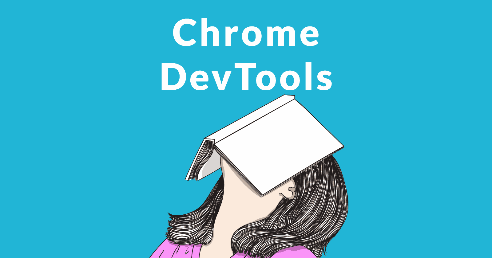
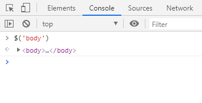
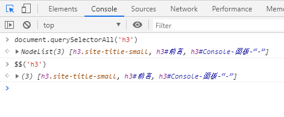
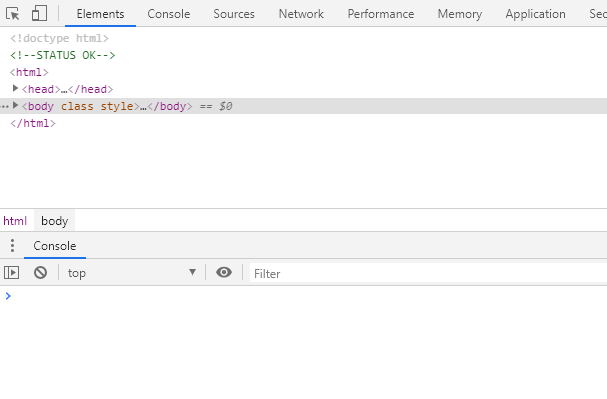
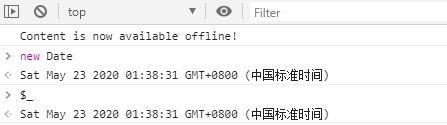
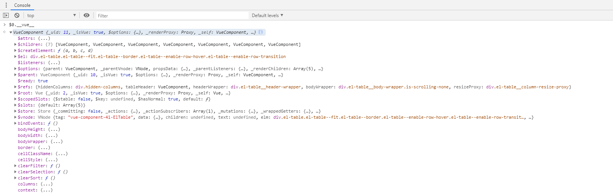
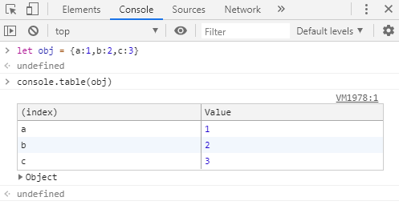
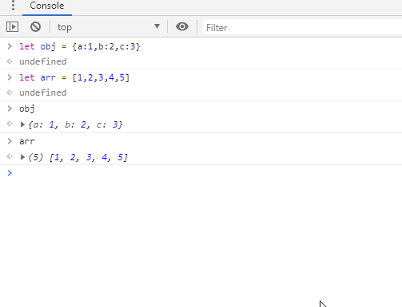
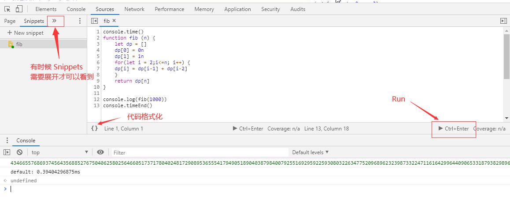

### 前言
> 我们每天都在写 ~~bug~~ 代码，那么拥有一身流畅的调试本领是十分重要的，下面是我总结一些实用的调试技巧，使无论在开发环境、生产环境都能够第一时间定位问题


    [526464145, 288307]


-----------------

### 正文 
下面你将了解 
- $
- $$
- $0~$4
- $_
- console.table
- Store as global
- copy()
- Snippets
- 断点调试
- command 菜单
- 常用快捷键

### Console面板-"$"
Console 面板是我们最喜欢打开的面板之一，可以用来查看输出的信息以及查询 api

 `$` 在 JQuery 它是选择器，那么在 Console 面板中它是 `document.querySelector`的简写

`$$` 是 `document.QuerySelectorAll` 的简写，并且返回的是一个数组，而不是一个 `Node List`

`$0` 是最后选择的 DOM 元素, `$1`是相对`$0`再上一个选择的元素，`$3、$4` 同理

`$_`与元素无关，它是控制台最后输出的值

当 `$` 遇上 `Vue`, 我们很轻松能够访问 Vue 的实例对象，尤其是在【生产环境】，没有 `Vue.js devtools`的时候，定位问题十分方便

### Console面板-通用

`console.table` 以表格形式展示数据，能够更清楚展示对象及数组

`copy()` 指定内容到剪贴板, 如 copy($_)等

的用法.gif)

`Store as global` 为对象或者数组取名字，在小三角处右键即可。方便后续调用以及或者 `copy()`

### Snippets(代码块)
相信不少人吐槽 Console 面板的换行问题，那么大可把代码移步至 `Sources - Snippets`
可以`正常换行`、`格式化代码`、`运行代码`、`持久储存`在浏览器中
Snippets + Console 面板 = 自带 API 的 JavaScript 编辑器
平时刷题，尤其是算法题时，能少打开一个应用就少打开一个应用😚
> 牛客网考试时，使用这个就不错，十分轻量级，一个 Google Chrome 浏览器足矣 🥳

### 断点调试
虽然 console.log 也能起到调试的作用，但是还是断点调试比较强大

### command菜单
快捷键 shift + ctrl + p

截图： Google Chrome 浏览器自带截图存为图片功能，不需要插件
- `Capture area screenshot` 选取截图（类似QQ截图）
- `Capture full size screenshot` 长截图
- `Capture node screenshot` 节点截图
- `Capture screenshot` 可视区域截图

> 既然说到截图，顺便安利下微软的 [snipaste](https://zh.snipaste.com/)
`免费无广告的可取色可调整透明度可看历史截图的一款贴图软件`
可以说前端必备，减少在 UI 与 代码 以及浏览器切换的频率

主题： theme  可选 dark / light 

### 其他
常用快捷键

-------------------------------

### 最后
希望大家用不上，愿世界无 BUG 
