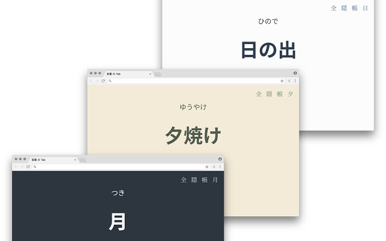
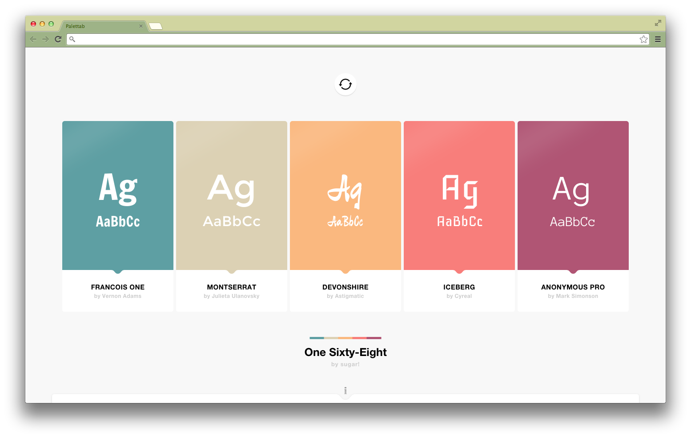
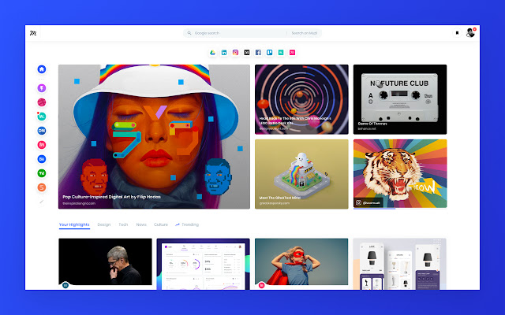
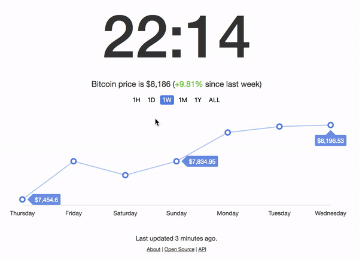

## 前言

写代码的日子里，总希望有点不一样。

浏览器是我的一个好朋友，我希望它能够变得漂漂亮亮的。

以 `Google Chrome` 为例。以下是我推荐的 `浏览器扩展`。

## 几枝

**几枝在新标签页上展示中国传统色的层叠波浪动画效果搭配经典诗词。**

> 尤其喜欢的是唯美的诗句配上意境的背景，我相信一定还有更多喜爱古诗词的程序猿~

下载地址：[Chrome Web Store 地址](https://chrome.google.com/webstore/detail/%E5%87%A0%E6%9E%9D/hfohpokminpknagcgncibpacohagppjn) | [Firefox Add-ons 地址](https://addons.mozilla.org/zh-CN/firefox/addon/jizhi/)

代码仓库：[https://github.com/unicar9/jizhi](https://github.com/unicar9/jizhi)

---

## Minimo

**优雅，简化的新标签页。**

有用的信息一目了然，时间日期、下载速度、当前电量、世界时钟、最近访问、添加 url，还可以化身为文本编辑器等...

下载地址：[Chrome Web Store 地址](https://chrome.google.com/webstore/detail/minimo/fanglmholkgdapjcfohfhnofcacjiodl/related)

代码仓库：[https://github.com/krismuniz/minimo](https://github.com/krismuniz/minimo)

---

## the-tab-of-words

**new Tab 化身日语学习卡片**

> 有兴趣的同学，可以修改下源码，学习一波英语。😌

下载地址：[Chrome Web Store 地址](https://chrome.google.com/webstore/detail/%E8%A8%80%E8%91%89-%E3%81%AE-tab/lacmiiahoideajihiclkhmdkikkbjcnb) | [Firefox Add-ons 地址](https://addons.mozilla.org/zh-CN/firefox/addon/the-tab-of-words/?src=https://github.com/wkei/the-tab-of-words)

代码仓库：[https://github.com/wkei/the-tab-of-words](https://github.com/wkei/the-tab-of-words)

---

## Palettab

**new Tab 化身为漂亮的调色板**

> 设计师同学的最爱。😌

下载地址：[Chrome Web Store 地址](https://chrome.google.com/webstore/detail/palettab/bidckpnndigbjhmojikkhmejkfkpgoih)

代码仓库：[https://github.com/tholman/palettab](https://github.com/tholman/palettab)

---

## Muzli 2 - Stay Inspired

**new Tab 为你展示最新鲜的有创意的网站**

> 对网络有一定的要求。😌

下载地址：[Chrome Web Store 地址](https://chrome.google.com/webstore/detail/muzli-2-stay-inspired/glcipcfhmopcgidicgdociohdoicpdfc)

---

## crypto-tab

**将您的 new Tab 页面替换为比特币价格图表**

> 尽在不言中。😌

下载地址：[Chrome Web Store 地址](https://chrome.google.com/webstore/detail/crypto-tab/hmbkmkdhhlgemdgeefnhfaffdpddohpa)

代码仓库：[https://github.com/superKalo/crypto-tab](https://github.com/superKalo/crypto-tab)

---

## 最后

有好看的记得告诉我，可古风可中二可酷炫！！🥰
