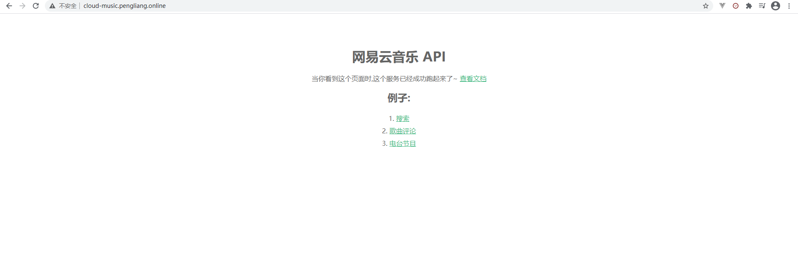
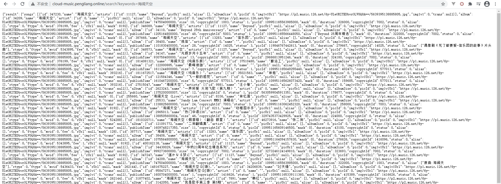

> 不管是看博客还是写博客，听音乐必然是不可少的一个节奏
> 但是吧，之前的网易云 API 是用的别人的
> 这几天突然就用不了，所以就打算自己部署一个

听首歌测试一下，快过年啦~ 三十的鞭炮太响啦，提前祝朋友们新年快乐~
送上我非常喜欢的两首歌, 两首歌都非常嗨 ❤

[524148679,395602]


## 开始

#### 准备

首先得有个服务器，然后搭上 `Nginx`，为了方便点，~~我绑定了域名 [http://cloud-music.pl-fe.cn/](http://cloud-music.pl-fe.cn/)~~

将 `网易云API` 的 node 应用部署在 `Nginx` 中

API : [https://neteasecloudmusicapi.vercel.app/#/](https://neteasecloudmusicapi.vercel.app/#/)
Github : [https://github.com/Binaryify/NeteaseCloudMusicApi](https://github.com/Binaryify/NeteaseCloudMusicApi)

> 好吧~ 😥 `https` 域名下不能混合 `http`请求， 改为 [https://pl-fe.cn/cloud-music-api/](https://pl-fe.cn/cloud-music-api/)

在 `nginx` 配置请求转发就可以解决问题

```
 location /cloud-music-api/ {
        proxy_pass http://cloud-music.pl-fe.cn/;
    }
```

---

#### 环境配置

安装依赖及 `pm2`

> 记得在服务器上先安装高版本 `node` 哦

```
npm install
```

```
npm install pm2 -g
```

---

#### 配置反向代理

`网易云 API` 的 nodejs 默认端口是 3000，`app.js` 可见
所以这里转发 `http://127.0.0.1:3000;`

```
server{
    listen 80;
    server_name cloud-music.pl-fe.cn;
    location / {
        proxy_pass http://127.0.0.1:3000;
    }
}
```

---

#### 启动

使用 `pm2` 启动 nodejs

```
pm2 start
```

这样 `pm2` 就会一直守护你的进程。
更多 pm2 的功能可以前往[pm2 官方](https://pm2.keymetrics.io/docs/usage/quick-start/)

---

#### 完成

这下可以访问了，效果如下。
访问 [http://cloud-music.pl-fe.cn/](http://cloud-music.pl-fe.cn/)


试试`搜索`

