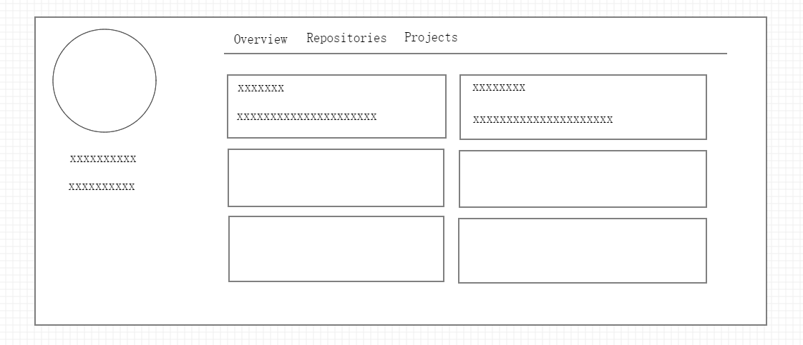
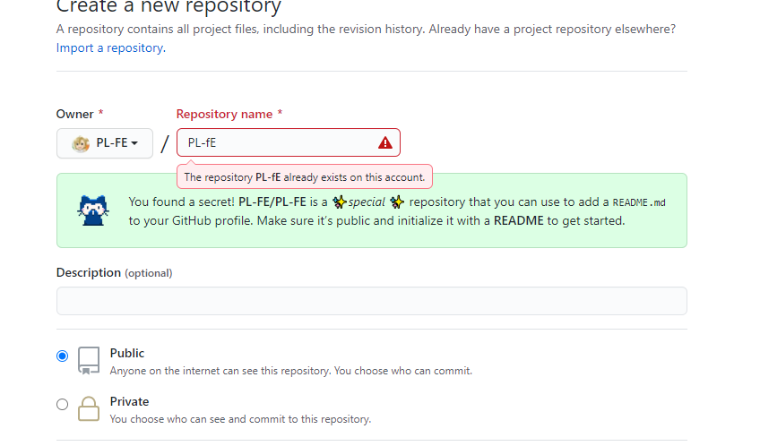
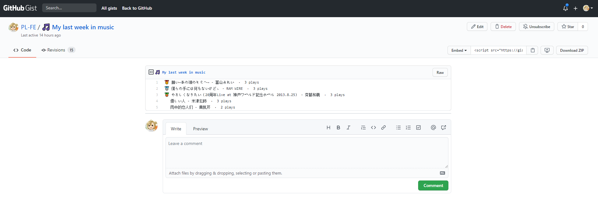


[1462030123, 1327816386]


#### 前言

`github` 毫无疑问是一个大型同性交友网站，一般来说，`github` 个人主页无非是这样：



信息量完全不够，有木有

所以自己改造了一下自己的个人主页


#### 教程

1. 建立 github 同名仓库
2. 统计卡片 [`github-readme-stats`](https://github.com/anuraghazra/github-readme-stats/blob/master/docs/readme_cn.md)，统计语言、github 提交等信息
3. 使用 action 定时运行 [`awesome-pinned-gists`](https://github.com/matchai/awesome-pinned-gists),统计 Steam 、网易云、Bilibili 、 Twitter 、YouTube 等信息

---

1. **建立 github 同名仓库, 这时候个人主页会出现一个大大的 README**



---

2. **统计卡片 [`github-readme-stats`](https://github.com/anuraghazra/github-readme-stats/blob/master/docs/readme_cn.md)**

只要在 README 在上一个链接即可
如：语言卡片

```bash
[](https://github.com/anuraghazra/github-readme-stats)
```

更多配置：
[https://github.com/anuraghazra/github-readme-stats/blob/master/docs/readme_cn.md](https://github.com/anuraghazra/github-readme-stats/blob/master/docs/readme_cn.md)

---

3. **工具：[`Gist`](https://gist.github.com/)、[`GitHub Action`](https://docs.github.com/cn/actions)、[`Awesome Pinned Gists`](https://github.com/matchai/awesome-pinned-gists)**

- [Gist](https://gist.github.com/) 是 Github 推出的基于 Git 的代码片段管理服务。用户可以提交自己的代码片段或任意的文本，可以作为个人的代码管理库、文档管理库
- [GitHub Action](https://docs.github.com/cn/actions) 是 GitHub 于 2018 年 10 月推出的一个 CI\CD 服务。
- [Awesome Pinned Gists](https://github.com/anuraghazra/github-readme-stats/blob/master/docs/readme_cn.md) 是用于向 gist 添加动态数据的开源代码工具列表

---

统计个人网易云信息 Demo
**准备工作：**

记住下面的参数：

- `gist` 账号
- 创建 [Github Token](https://github.com/settings/tokens/new),需要勾选`gist`选项
- 网易云账号 id： 登录 [https://music.163.com)](https://music.163.com)
  (ID 为`头像 - 我的主页`（xxx/#/user/home?id=xxx），id 后紧跟的那串数字)
- 网易云 token： 在登录态下打开浏览器开发者工具，选择 `Application` 查看 `Cookie`，获取 key 为 `MUSIC_U` 的 value

后面需要把一些私人信息加入当前仓库的环境变量中

**开始：**

1. Fork [netease-music-box](https://github.com/PL-FE/netease-music-box)

2. 进入 Fork 后的仓库，启用 `Github Actions`

3. 编辑 .github/workflows/schedule.yml 文件中的环境变量：(已经配置好)

4. GIST_ID: ID 是新建 Gist 的 url 后缀: https://gist.github.com/Leecason/b51bc9844585c33775edc27bb38ad2ab

USER_ID: 网易云音乐用户 ID

5. 在`项目`的 Settings > Secrets 中创建两个变量 GH_TOKEN 和 USER_TOKEN，分别为 Github Token 和 网易云音乐用户 Token

6. 在个人资料中嵌入 Gist

ok

**结果：**

在个人资料中嵌入 Gist 即可

更多，如：Steam 、Bilibili 、 Twitter 、YouTube...
详情： [Awesome Pinned Gists](https://github.com/matchai/awesome-pinned-gists)

---

#### 最后

完成一系列操作后，他人访问你的主页，接待的不再是冰冷冷的 6 个仓库。
刚好最近有听同一首歌，刚好最近在玩同一款游戏..
还可以更多，如在 README 加入[聊天室功能](https://jingmatrix.github.io/private/)
故事就发生了 🥳
尝试丰富你的主页吧
