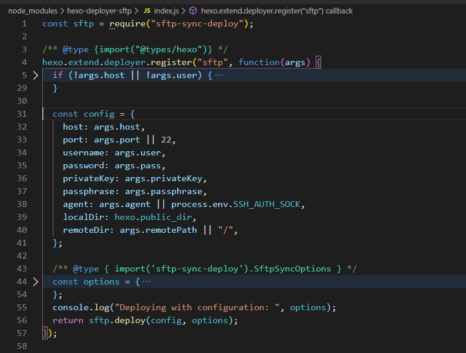

#### 前言

Hexo 本身提供了很多快速方便的一键部署功能，让您只需一条命令就能将网站部署到服务器上。
配置文件： `_config.yml`
但是在配置文件中使用 `sftp` 发布到服务器，需要一些明文信息。然后不希望将这些信息暴露出去。
在网上搜索了好大半天，发现文章篇幅都比较长 ~~其实是我看不懂 😭~~ 所以自己尝试了两个较简单的方法。

大前提是使用 [`sftp-sync-deploy`](https://github.com/dobbydog/sftp-sync-deploy) 这个包来将自己的文件发布上去，hexo 部署是使用`hexo-deployer-sftp` (核心是 `sftp-sync-deploy`)。



然后不想暴露密码，咱们可以

- 使用 `inquirer.js` 实时输入账号密码等信息
- 将私密信息添加到 github 上， 通过 `github action` 自动部署

#### 准备

随便找个地方实现一个发布功能的文件 `deploy.js`

参考：

- node_modules\hexo-deployer-sftp\index.js
- [sftp-sync-deploy](https://github.com/dobbydog/sftp-sync-deploy)

大概长得和这样它这样 [sftp-sync-deploy](https://github.com/dobbydog/sftp-sync-deploy)

然后 `package.json` 中创建调用它的命令

---

#### inquirer.js

实时输入密码，作为变量传递

```js
const { deploy } = require('sftp-sync-deploy')
const inquirer = require('inquirer')

const promptList = [
  {
    type: 'input',
    message: '请输入密码:',
    type: 'password',
    name: 'password',
  },
]

inquirer.prompt(promptList).then(({ password }) => {
  let config = {
    host: 'http://127.0.0.1/', // Required.
    username: 'root', // Required.
    password, // Optional.
    localDir: './public', // Required, Absolute or relative to cwd.
    remoteDir: '/', // Required, Absolute path only.
  }

  let options = {
    dryRun: false, // Enable dry-run mode. Default to false
    exclude: [
      // exclude patterns (glob)
      'node_modules',
      'src/**/*.spec.ts',
    ],
    excludeMode: 'remove', // Behavior for excluded files ('remove' or 'ignore'), Default to 'remove'.
    forceUpload: false, // Force uploading all files, Default to false(upload only newer files).
    concurrency: 100, // Max number of SFTP tasks processed concurrently. Default to 100.
  }

  return deploy(config, options)
})
```

---

#### Github Action

为了减少文章篇幅，关于 Github Action 可以参考

- [官方 docs(解释每个配置项)](https://docs.github.com/cn/actions/reference/workflow-syntax-for-github-actions#)
- [阮一峰-GitHub Actions 入门教程](http://www.ruanyifeng.com/blog/2019/09/getting-started-with-github-actions.html)

  这个就比较舒服了，提交代码自动构建编译部署至服务器上，释放双手~

- 在`项目`的 Settings > Secrets 中创建需要的环境变量
- 初始化 Github Action，并且配置好 steps > env 环境变量
  如：

```yml
jobs:
  build:
    # ...
    steps:
      # ...
      env:
        HOST: ${{ secrets.HOST }}
        PASSWORD: ${{ secrets.PASSWORD }}
        REMOTEDIR: ${{ secrets.REMOTEDIR }}
```

具体可以参考[我的 hexo schedule.yml](https://github.com/PL-FE/hexo-blog/blob/master/.github/workflows/schedule.yml)

这时候需要修改一下 `deploy.js`，
需要获取配置在 github > Secrets 的环境变量，大概长下面这样

```js
const { deploy } = require('sftp-sync-deploy')
const { HOST: host, PASSWORD: password, REMOTEDIR: remoteDir } = process.env

let config = {
  host, // Required.
  username: 'root', // Required.
  password, // Optional.
  localDir: './public', // Required, Absolute or relative to cwd.
  remoteDir, // Required, Absolute path only.
}

let options = {
  dryRun: false, // Enable dry-run mode. Default to false
  exclude: [
    // exclude patterns (glob)
    'node_modules',
    'src/**/*.spec.ts',
  ],
  excludeMode: 'remove', // Behavior for excluded files ('remove' or 'ignore'), Default to 'remove'.
  forceUpload: false, // Force uploading all files, Default to false(upload only newer files).
  concurrency: 100, // Max number of SFTP tasks processed concurrently. Default to 100.
}

return deploy(config, options) // 需要返回给调用者
```

具体可以参考[我的 hexo deploy.js](https://github.com/PL-FE/hexo-blog/blob/master/deploy.js)

---

#### 最后

如果用到账号什么的，大家注意不要明文展示哦，可以分配一个`最小权限账号`或者`私钥`
如果有更好的方法，一定要分享下给我！！！༼ つ ◕_◕ ༽つ
