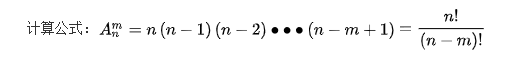
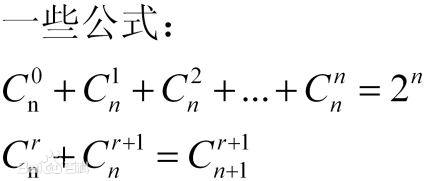

#### 前言

最近有看到一些数学题，是组合排列，是高中数学，由于后面不怎么用，如今已经全部还给老师了(^///^))，所以打算写一遍文章回顾下，方便以后回顾下。

如有错误，欢迎交流！

#### 定义及相关

**排列的定义**

从 n 个不同元素中，任取 m(m≤n,m 与 n 均为自然数,下同）个不同的元素按照一定的顺序排成一列，叫做从 n 个不同元素中取出 m 个元素的一个排列；

从 n 个不同元素中取出 m(m≤n）个元素的所有排列的个数，叫做从 n 个不同元素中取出 m 个元素的排列数，用符号 A(n,m）表示。

**组合的定义**

组合的定义：从 n 个不同元素中，任取 m(m≤n）个元素并成一组，叫做从 n 个不同元素中取出 m 个元素的一个组合；

从 n 个不同元素中取出 m(m≤n）个元素的所有组合的个数，叫做从 n 个不同元素中取出 m 个元素的组合数。用符号 C(n,m) 表示。

**符号**

C-Combination 组合数 [1]
A-Arrangement 排列数（在旧教材为 P-Permutation）
N-Number 元素的总个数
M- 参与选择的元素个数
！- Factorial 阶乘

#### 题目

**【例 1】 从 1、2、3、……、20 这二十个数中任取三个不同的数组成等差数列，这样的不同等差数列有多少个？**

分析：首先要把复杂的生活背景或其它数学背景转化为一个明确的排列组合问题。
设 a,b,c 成等差，∴ 2b=a+c，可知 b 由 a,c 决定，
又 ∵ 2b 是偶数，∴ a,c 同奇或同偶，即：分别从 1，3，5，……，19 或 2，4，6，8，……，20 这十个数中选出两个数进行排列，由此就可确定等差数列，A（10,2）2=902，因而本题为 180。

**【例 2】从 6 双不同颜色的手套中任取 4 只，其中恰好有一双同色的取法有多少种？**

分析：显然本题应分步解决。

从 6 双中选出一双同色的手套，有 C（6,1）=6 种方法
从剩下的 5 双手套中任选两双，有 C（5,2）=10 种方法
从两双中手套中分别各拿一只手套，有 C（2,1）×C（2,1）=4 种方法。
同样得出共 ⑴×⑵×⑶=240 种。

#### 全排列

// 待我学会。。。
